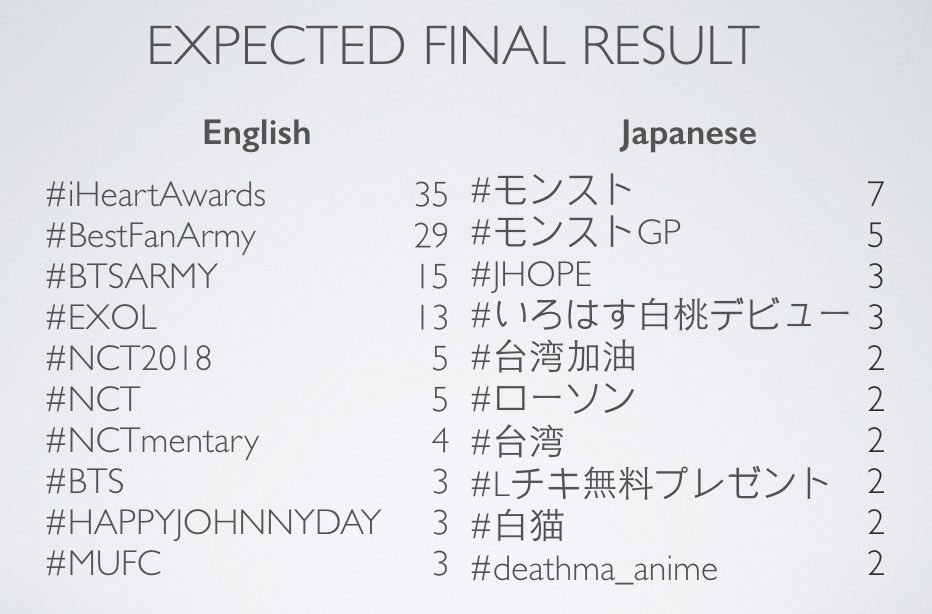
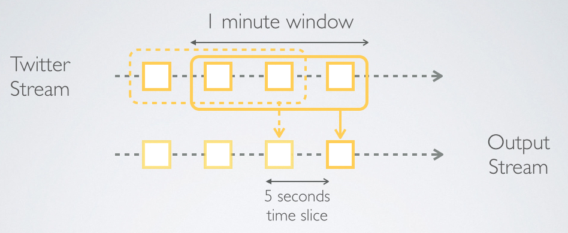
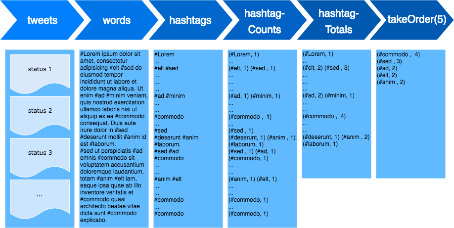
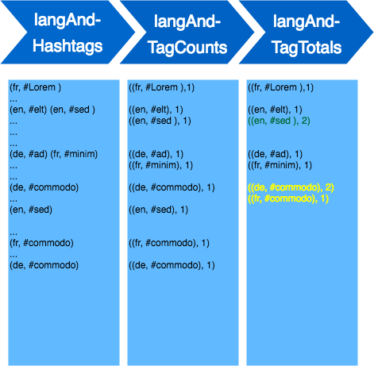
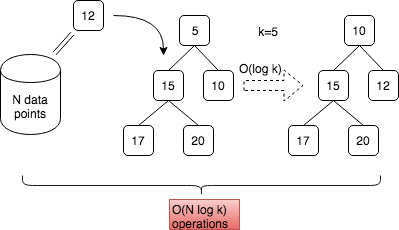
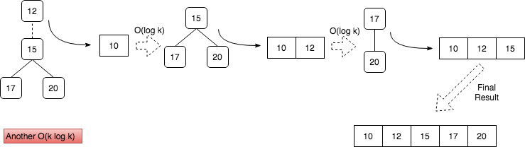
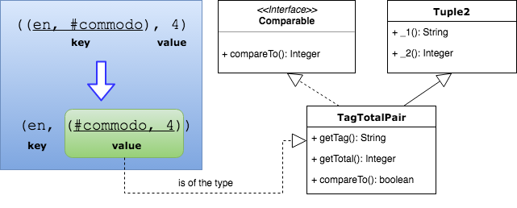

# TwitterPopularTags

## Overview

In this work, I create a Spark Streaming application which retrieve real-time twitter stream using `org.apache.spark.streaming.twitter.TwitterUtils`. My goal is to create a list of top-ten most popular hashtags for each of the languages being supported by Twitter platform.



For simplicity, I fixed 10 as the maximum number of the popular hashtags to be shown on the list. Popularity is defined by how many times a particular hashtag appears in the twitter stream during *the most recent one-minute period*. Also, the result will be updated every five seconds.



The following code chunk setting up the number of hashtags to be shown (`topNTags`), the duration for aggregating total numbers for each hashtag (`outputWindow`), and the frequency of how the streaming application updating the result (`outputWindow`).

```java
final Integer topNTags = 10;
Duration outputSlide = new Duration(5000);
Duration outputWindow = new Duration(60000);
```

In order to, to connect the application to Twitte API, credentials need to be specified. The last line of the below code chunk create `DStream` with `TwitterUtils.createStream`. See also [Advanced Sources](https://spark.apache.org/docs/1.6.2/streaming-programming-guide.html#advanced-sources) section on Spark 1.6 official site.

```java
// Configuring Twitter credentials
String apiKey = "";
String apiSecret = "";
String accessToken = "";
String accessTokenSecret = "";
System.setProperty("twitter4j.oauth.consumerKey", apiKey);
System.setProperty("twitter4j.oauth.consumerSecret", apiSecret);
System.setProperty("twitter4j.oauth.accessToken", accessToken);
System.setProperty("twitter4j.oauth.accessTokenSecret", accessTokenSecret);

JavaReceiverInputDStream<Status> tweets = TwitterUtils.createStream(jssc);
```

## Global Popular Tags

### Counting Hashtags



The code for counting twitter hashtag is already included in an official code example for spark streaming available on [github](https://github.com/apache/spark/blob/ea59b0f3a6600f8046e5f3f55e89257614fb1f10/examples/src/main/java/org/apache/spark/examples/streaming/JavaTwitterHashTagJoinSentiments.java#L73-L114).

My code below is almost identical to a that example.

#### words
The first step is to extract words from each twitter status coming from the twitter stream.

```java
JavaDStream<String> words = tweets.flatMap(new FlatMapFunction<Status, String>() {
    @Override
    public Iterable<String> call(Status s) throws Exception {
        return Arrays.asList(s.getText().split("\\s+"));
    }
});
```

#### hashtags
Then filter is used to select only those words which are hashtag, i.e., those starting with the '#' character.

```java
JavaDStream<String> hashTags = words.filter(new Function<String, Boolean>()  {
    @Override
    public Boolean call(String word) throws Exception {
        return word.startsWith("#");
    }
});
```

#### hashtagCount

Then, Key-Value pair is created with hashtag as a key and value equal to one. At this point, any single appearance of the hashtag corresponds with one key-value pair and possibly many pairs with the same key will appear in the resulting `hashTagCount` DStream until they are aggregated together in the next stage.

```java
JavaPairDStream<String, Integer> hashTagCount = hashTags.mapToPair(
        new PairFunction<String, String, Integer>() {
            @Override
            public Tuple2<String, Integer> call(String s) throws Exception {
                return new Tuple2<String, Integer>(s, 1);
            }
        });
```

#### hashtagTotals
Keyed transformation `reduceByKeyAndWindow` is applied to perform aggregation. In this way, the number of times each tuple with a unique key [hashtag] appear in `hashTagCount` will be summed up. As a result, each key will be paired with its frequency.

```java
Function2<Integer, Integer, Integer> addition = new Function2<Integer, Integer, Integer>()  {
    @Override
    public Integer call(Integer a, Integer b) throws Exception {
        return a + b;
    }
};


JavaPairDStream<String, Integer> hashTagTotals = hashTagCount
        .reduceByKeyAndWindow(addition, outputWindow, outputSlide);
```

###  Top 10 Tags Globally

Within `foreachRDD`, `takeOrdered` is used to get the top ten hashtag with highest popularity. The result is sent out over the network via [socket.IO](https://github.com/socketio/socket.io-client-java).

```java
class MyComparable implements Comparator<Tuple2<String, Integer>>, Serializable {
    public int compare(Tuple2<String, Integer> o1, Tuple2<String, Integer> o2) {
        return o2._2() - o1._2();
    }
};

hashTagTotals.foreachRDD(new VoidFunction<JavaPairRDD<String, Integer>>() {
    @Override
    public void call(JavaPairRDD<String, Integer> htTotal) throws Exception {

        List<Tuple2<String, Integer>> topList = htTotal.takeOrdered(topNTags, new MyComparable());

        // List of (tag, cnt)
        JSONArray jsonArr = new JSONArray();

        for(Tuple2<String, Integer> e: topList) {
            // Single (tag, cnt)
            JSONObject tagcnt = new JSONObject();
            jsonArr.put(tagcnt.put("tag", e._1()).put("count", e._2()));
        }
        socket.emit("topTags",jsonArr);
    }
});
```

## Popular Tags per Language

### Counting per Language



Now I want to separate the hashtag into different groups based to the language of the twitter's status - not of the hashtag itself. This can be done by augmenting the language code with the hashtag when creating the key-value pair with frequency one.

By doing this, if a unique hashtag appears on many twitter statuses which come in more than one languages. The application count the hashtag's frequency separately for any particular language - as highlighted in yellow.

```java
JavaPairDStream<String,String> langWordPairs = tweets.flatMapToPair(
        new PairFlatMapFunction<Status, String, String>() {
            @Override
            public Iterable<Tuple2<String, String>> call(Status s) throws Exception {
                String[] words = s.getText().split("\\s+");
                ArrayList<Tuple2<String, String>> pairs = new ArrayList<Tuple2<String, String>>(words.length);
                for (int i = 0; i != words.length; ++i) {
                    pairs.add(new Tuple2<String, String>(s.getLang(), words[i]));
                }
                return pairs;
            }
        }
);

JavaPairDStream<String,String> langAndHashTags = langWordPairs.filter(
        new Function<Tuple2<String, String>, Boolean>() {
            @Override
            public Boolean call(Tuple2<String,String> lt) throws Exception {
                return lt._2().startsWith("#");
            }
        });


JavaPairDStream<Tuple2<String,String>, Integer> langAndTagCounts = langAndHashTags.mapToPair(
        new PairFunction<Tuple2<String, String>, Tuple2<String,String>, Integer>(){
            @Override
            public Tuple2<Tuple2<String,String>, Integer> call(Tuple2<String, String> lt) throws Exception {
                return new Tuple2<Tuple2<String,String>, Integer>(lt, 1);
            }
        }
);

JavaPairDStream<Tuple2<String,String>, Integer> langAndTagTotals = langAndTagCounts
        .reduceByKeyAndWindow(addition,outputWindow, outputSlide);
```
## Top 10 tags per Language

This part will be highlight of my code.

### Motivation

Finding top `K` items in a list of size `N` can be performed efficiently with the cost `O(N log K)` if the data structure called **min-heap** is used. A Canadian programmer *Steve Hanov* in his [blog](http://stevehanov.ca/blog/index.php?id=122) compared this heap-based method to:
```
# find the top 10 results
results = sorted(results, reverse=True)[:10]
```
This sorted-based method takes `O(N log N)`, which is less efficient.

To be precise, this **min-heap** must maintains only the top `K` elements that we've found so far collecting data. If a new data point is found to be larger than the smallest member in the heap. Removing the top of the heap takes  `O(1)`. This is absorbed into the cost of putting a new data point into heap which equals `O(log K)` because the size of the heap never exceed `K`.

With `N` data points, the total time cost of operations become `O(N log K)`.



When all of the `N` data points has been considered, the smallest member in the heap is removed one by one to build an `Array`. Each removal takes `O(log K)` and so `K` removal takes `O(K log K)`. It's safe to assume that `N >> K`. So `O(K log K) + O(N log K) = O(N log K)`.




### Implementation

In his response to the question [Efficient way to get top K values per key in (key, value) RDD?
](https://mail-archives.apache.org/mod_mbox/spark-user/201412.mbox/%3CCAMAsSd%2BFKnnotUPFyaJm1dykH14dDbKpL7DsdwemGzdqvOCLNA%40mail.gmail.com%3E), *Sean Owen* from Cloudera recommended creating **min-queue** for each key and then use `combineByKey` to merge values into the queue.

We will refer to **min-queue** or heap interchangeably. According to this [Stackoverflow's post](https://stackoverflow.com/questions/6065710/how-does-javas-priorityqueue-differ-from-a-min-heap), PriorityQueue in Java use heap in its implementation.

#### Some Pre-process

Previously, frequencies of each hashtag per each language was calculated in DStream `langAndTagTotals`. At that point, the tuple `(language, hashtag)` was key, while frequency was value.

There are two changes to be made before we go to `combineByKey` step.
1. Language is used as key. This is because `combineByKey` will find top ten items for each key.
2. The value part now contains a pair of hashtag with its frequency. In order to do ranking, we need to be able to compare a pair with one another. Because of this, I wrap the pair into a tuple which implement `Comparable` method.



```java
class TagTotalPair extends Tuple2<String, Integer> implements Comparable<TagTotalPair>, Serializable {
    public String getTag(){
        return this._1();
    }
    public Integer getTotal(){
        return this._2();
    }
    TagTotalPair(String tag, Integer total) {
        super(tag, total);
    }
    public int compareTo(TagTotalPair o) {
        return this.getTotal() - o.getTotal();
    }
};

JavaPairDStream<String, TagTotalPair> langAndTagTotals2 = langAndTagTotals.mapToPair(new PairFunction<Tuple2<Tuple2<String,String>, Integer>, String, TagTotalPair>(){
            @Override
            public Tuple2<String, TagTotalPair> call(Tuple2<Tuple2<String,String>, Integer> langTagTots) throws Exception {
                Tuple2<String,String> langTag = langTagTots._1();
                String lang = langTag._1();
                String tag = langTag._2();
                Integer total = langTagTots._2();
                return new Tuple2<String, TagTotalPair>(lang, new TagTotalPair(tag, total));
            }
        }
);
```

#### Min-heap to Maintain Top Items

I use Java's PriorityQueue to implement **min-heap**.
In order to maintain on top `K` items and no more, the following logic must be implement when adding new item:
* The heap always adds a new member if its size is < `K`.
* If size >= `K`, only add a new item if it exceeds the smallest element; if so remove the smallest element before adding an item.

```java
 class MinQStringPair extends PriorityQueue<TagTotalPair> {
     int maxSize;
     MinQStringPair(int maxSize) {
         super(maxSize);
         this.maxSize = maxSize;
     }
     public boolean add(TagTotalPair newPair) {
         if(size() < maxSize )  {
             super.add(newPair);
             return true;
         }
         else if(newPair.compareTo(super.peek()) > 0) {
             super.poll();
             super.add(newPair);
             return true;
         }
         return false;
     }
 };
```

#### combineByKey

Actual implementation is carried by combineByKey which internally call these three following functions:

1. `createCombiner` is called when a key(in the RDD element) is found for the first time in a given Partition. This method creates an initial value for the accumulator for that key.
   * In our case, the accumulator is our heap. An empty heap is created when a key(or language) is found.
2. `mergeValue` is called when the key already has an accumulator.
   * When an accumulator(heap) met with a new item, an item is added (or not) according to the logic in last section.
3. `mergeCombiners` is called when more than one partition has accumulator for the same key
   * Two heaps from different partitions are merged by simply removing items from one heap and add it to another one-by-one.


```java
Function<TagTotalPair, MinQStringPair> createCombiner = new Function<TagTotalPair, MinQStringPair>() {
    public MinQStringPair call(TagTotalPair langCnt) throws Exception{
        MinQStringPair minQ = new MinQStringPair(topNTags);
        minQ.add(langCnt);
        return minQ;
    }
};
Function2<MinQStringPair, TagTotalPair, MinQStringPair> mergeValue =
        new Function2<MinQStringPair, TagTotalPair, MinQStringPair>() {
            public MinQStringPair call(MinQStringPair minQ, TagTotalPair langCnt) throws Exception {
                minQ.add(langCnt);
                return minQ;
            }
        };
Function2<MinQStringPair, MinQStringPair, MinQStringPair> mergeCombiners =
        new Function2<MinQStringPair, MinQStringPair, MinQStringPair>() {
            public MinQStringPair call(MinQStringPair qa, MinQStringPair qb) throws Exception {
                MinQStringPair qc, qd;
                if(qa.size() > qb.size()) { qc = qa; qd = qb; }
                else { qc = qb; qd = qa; }
                while(qd.size() != 0)
                    qc.add(qd.poll());
                return qc;
            }
        };

JavaPairDStream<String, MinQStringPair> langAndTogNTags =
        langAndTagTotals2.combineByKey(createCombiner, mergeValue, mergeCombiners, new HashPartitioner(4), true);
```

Each element in RDD, which is a key-value pair of language<String> and min-heap<PriorityQueue>, already contains hashtag with top-ten popularity. Just collect them and convert to ArrayList before sending out via socketio.

```java
langAndTogNTags.foreachRDD(new VoidFunction<JavaPairRDD<String, MinQStringPair>>() {
    @Override
    public void call(JavaPairRDD<String, MinQStringPair> langAndMinQ) {
        try {
            List<Tuple2<String, MinQStringPair>> topList = langAndMinQ.collect();

            JSONArray jsonArr1 = new JSONArray();

            for (Tuple2<String, MinQStringPair> pair : topList) {

                JSONObject jsonObj = new JSONObject();

                System.out.println(String.format("%s :", pair._1()));

                jsonObj.put("lang", pair._1());

                ArrayList<TagTotalPair> langCntList = new ArrayList<TagTotalPair>(pair._2());
                Collections.sort(langCntList);
                Collections.reverse(langCntList);
                JSONArray jsonArr2 = new JSONArray();
                for (TagTotalPair e : langCntList) {
                    System.out.print(String.format(" (%s,%d)", e.getTag(), e.getTotal()));
                    jsonArr2.put(new JSONObject().put("tag", e.getTag()).put("count", e.getTotal()));
                }

                System.out.println();
                jsonObj.put("topTags", jsonArr2);
                jsonArr1.put(jsonObj);
            }

            socket.emit("topTagByLangs", jsonArr1);
        } catch (JSONException ex) {
            java.util.logging.Logger.getLogger(Main.class.getName()).log(java.util.logging.Level.SEVERE, null, ex);
        }
    }
});
```
